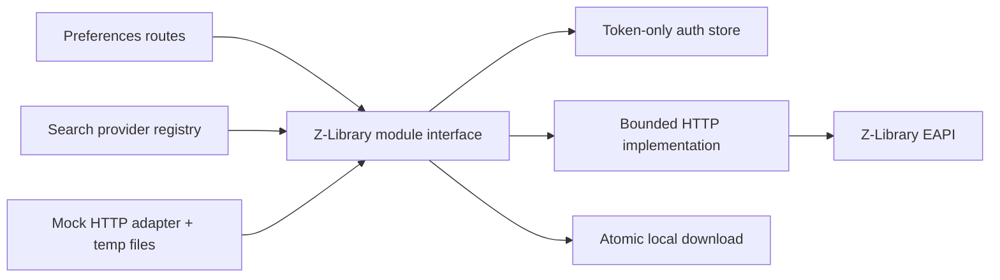

# Z-Library Connection Hardening Plan

Status: proposed
Created: 2026-07-11
Scope: replace the implementation behind Alexandrio's existing Z-Library provider without adding a Python runtime or a third-party Z-Library package.

## Decision

Keep the existing multi-source provider registry and replace `lib/zlibrary.js` with a deep, Node-native module. The module will own authentication, token storage, domain selection, request policy, response interpretation, status reporting, search normalization, download limits, and atomic downloads.

Use the external projects only as references:

- `bipinkrish/Zlibrary-API` for `/eapi` endpoint coverage and parameter shapes.
- `zlibrary-sync` for typed errors, response validation, and download validation ideas.
- `sertraline/zlibrary` only for mirror/proxy lessons; do not adopt its HTML scraping path or GPL implementation.

## Goals

1. Report the connection truthfully: disconnected, connected, authentication expired, or temporarily unavailable.
2. Keep anonymous Z-Library search available; require an account only for profile/quota and downloads.
3. Stop storing the user's Z-Library password after login.
4. Bound every network operation with timeouts and narrow retry rules.
5. Surface Z-Library failures through `sourceStatus` instead of presenting them as zero search results.
6. Support changing Z-Library domains without code edits while preventing private-network requests.
7. Preserve atomic, streaming downloads and add response and size validation.
8. Test the module through its public interface with a mocked HTTP adapter and real temporary files.

## Non-goals

- Adding Python, `zlibrary`, or `zlibrary-sync` as a runtime dependency.
- Scraping Z-Library HTML or bypassing CAPTCHA/browser challenges.
- Supporting Tor or proxy chains in this change.
- Exposing the full unofficial EAPI surface such as recommendations, saved books, registration, or account mutation.
- Guaranteeing availability of an unofficial third-party service or any particular domain.
- Running authenticated external-service tests in the normal test suite.

## Current failure modes to remove

- `isConfigured()` checks for stored fields, not a valid session.
- The provider currently hides Z-Library search unless credentials are stored, although live EAPI probes confirm anonymous search works.
- `getProfile()` converts every failure into a fabricated `0 / 10` profile.
- `search()` converts every failure into an empty result list.
- Authentication retry only recognizes HTTP 401 even though the service can return HTTP 400 with `Please login`.
- Disconnect removes the file but leaves the in-memory authentication cache active.
- Email and password are persisted in `data/zlibrary-auth.json`.
- Requests have no module-level timeout or controlled retry policy.
- Search extensions are JSON-encoded instead of using repeated bracket parameters.
- The download URL, which may contain sensitive query data, is logged.
- The provider registry knows about Z-Library profile and limit internals.
- There are no direct tests for login, status, search, or download behavior.

## Target design



The external seam remains `lib/zlibrary.js`. Callers should not know about remix headers, cookies, login response variants, domains, retries, profile fields, or temporary files.

### Proposed module interface

```js
const client = createZLibraryClient(options);

client.hasStoredSession();
client.connect({ email, password });
client.disconnect();
client.getStatus();
client.search(query, { limit, extensions, languages });
client.download({ zlibId, hash }, destinationPath);
```

`createZLibraryClient()` accepts injected implementation dependencies for tests:

- `fetchImpl` — production `fetch`, mocked in tests.
- `authFile` — production data path, temporary path in tests.
- `baseUrl` — `ZLIBRARY_BASE_URL` or the default domain.
- `requestTimeoutMs`, `downloadTimeoutMs`, and `maxDownloadBytes`.
- `now` and `sleep` for deterministic retry tests.

The default export remains a singleton so current `require('./lib/zlibrary')` call sites do not need construction logic.

### Status contract

`getStatus()` always returns one of these states and never invents quota values:

| State | Stored session | Remote result | UI meaning |
| --- | --- | --- | --- |
| `disconnected` | No | Anonymous search only | Search available; connect to download |
| `connected` | Yes | Profile validated | Connected; quota is trustworthy |
| `auth-expired` | Yes | Login required/invalid token | Reconnect required |
| `unavailable` | Yes | Timeout, DNS, 429, 5xx, or challenge | Temporarily unavailable |

Successful status shape:

```json
{
  "configured": true,
  "state": "connected",
  "reachable": true,
  "authenticated": true,
  "searchAvailable": true,
  "downloadAvailable": true,
  "downloadsToday": 2,
  "dailyLimit": 10,
  "downloadsRemaining": 8,
  "lastVerifiedAt": "2026-07-11T18:00:00.000Z"
}
```

Failure states omit quota fields and include a stable, safe `errorCode` and user-facing `message`.

### Error taxonomy

Create `ZLibraryError` with `code`, `statusCode`, `publicMessage`, optional safe `details`, and internal `cause`.

| Code | Meaning | HTTP mapping |
| --- | --- | --- |
| `ZLIB_NOT_CONFIGURED` | No stored remix session | 409 for operations; status remains 200 |
| `ZLIB_AUTH_INVALID` | Login credentials rejected | 401 |
| `ZLIB_AUTH_EXPIRED` | Stored remix session rejected | 401 |
| `ZLIB_TIMEOUT` | Request exceeded its deadline | 504 |
| `ZLIB_UNAVAILABLE` | DNS, challenge, or upstream 5xx | 503 |
| `ZLIB_RATE_LIMITED` | Upstream request throttled | 429 |
| `ZLIB_DAILY_LIMIT` | Account download quota exhausted | 429 |
| `ZLIB_PROTOCOL` | Unexpected JSON or response shape | 502 |
| `ZLIB_DOWNLOAD_INVALID` | Non-file, empty, oversized, or interrupted download | 502 |

Only safe public messages enter route responses or `sourceStatus`. Raw response bodies, credentials, tokens, cookies, and download URLs remain server-log secrets and must not be logged.

### Persisted authentication schema

Replace the current credential file with schema version 2:

```json
{
  "version": 2,
  "userId": "12345",
  "userKey": "redacted-remix-token",
  "baseUrl": "https://z-library.sk",
  "verifiedAt": "2026-07-11T18:00:00.000Z"
}
```

The file remains mode `0600` and is written atomically. Email and password are used only during `connect()` and are never persisted or logged.

Legacy schema migration:

1. Detect the existing unversioned file.
2. Retain only `userId`, `userKey`, the validated base URL, and timestamp.
3. Atomically rewrite it as version 2 immediately, removing email and password even if the token later proves expired.
4. If the legacy file is malformed, report `disconnected`; do not overwrite it until explicit reconnect or disconnect.
5. Never create a backup containing the old plaintext password.

## Implementation phases

### Phase 0 — Confirm the remote contract safely

Files: no committed code required; optionally add redacted fixtures under `test/fixtures/zlibrary/`.

1. With a user-supplied account, manually inspect successful `/eapi/user/login`, `/eapi/user/profile`, `/eapi/info/domains`, `/eapi/book/search`, and file-ticket response shapes.
2. Record only field names and sanitized representative values. Never save cookies, IDs, tokens, personal domains, or a raw authenticated response.
3. Confirm how invalid/expired authentication is expressed: HTTP status plus JSON body.
4. Confirm whether login tokens arrive in JSON, `Set-Cookie`, or both.
5. Confirm bracket-array encoding for `extensions[]` and `languages[]`.
6. Confirm whether a download ticket points directly to a CDN/personal domain and whether it requires remix cookies.

Exit condition: the implementation has sanitized fixtures for every response variant it must parse. If authenticated probing is unavailable, support both known login shapes and mark live verification as a release blocker rather than guessing one shape.

### Phase 1 — Establish the deep module and test seam

Files:

- Modify `lib/zlibrary.js`.
- Add `test/test-zlibrary.js`.
- Add `test/test-zlibrary-fixtures.js` only if fixture helpers materially reduce duplication.
- Register the new suite in `test/run-all.js`.

Steps:

1. Introduce `createZLibraryClient(options)` and keep a default singleton export.
2. Inject `fetchImpl`, paths, clocks, limits, and retry sleep.
3. Add `ZLibraryError` and one private error-normalization path.
4. Implement `hasStoredSession()` without remote I/O; its meaning is strictly "usable token fields are stored," not "connected."
5. Keep transport, storage, and response parsers private to the module.
6. Use real temporary directories in tests and a queued mock-fetch adapter for remote behavior.

Tests:

- Missing, malformed, legacy, and version-2 auth files.
- Factory instances do not share in-memory state.
- Errors expose safe stable codes while retaining an internal cause.
- Existing default singleton exports remain callable by `server.js`.

Exit condition: callers can use the proposed interface, all tests are offline, and no production behavior has changed yet.

### Phase 2 — Replace credential persistence with token lifecycle

Files:

- Modify `lib/zlibrary.js`.
- Modify `lib/routes/preferences-routes.js`.
- Extend `test/test-zlibrary.js`.

Steps:

1. Implement `connect({ email, password })` against the confirmed login endpoint.
2. Parse both confirmed token sources if necessary, normalize to `userId` and `userKey`, and validate them with a profile request before writing.
3. Write schema version 2 via a same-directory temporary file, `chmod(0600)`, and rename.
4. Implement the legacy migration without persisting email or password.
5. Implement `disconnect()` inside the module so it clears disk state, in-memory session state, cached status, and domain state together.
6. Change the routes to call `connect()` and `disconnect()`; routes must no longer manipulate `zlibrary-auth.json` directly.
7. Return safe authentication errors without including the upstream body.

Tests:

- Invalid credentials do not create or modify the auth file.
- Successful login writes token-only schema version 2 with mode `0600`.
- Profile validation failure prevents persistence.
- Legacy files are rewritten without `email` or `password`.
- Disconnect clears both the file and the same process's memory immediately.
- A second disconnect succeeds idempotently.

Exit condition: no successful code path persists an account password, and disconnect is truthful without restarting the server.

### Phase 3 — Centralize bounded HTTP and domain policy

Files: modify `lib/zlibrary.js` and `test/test-zlibrary.js`.

Steps:

1. Add one private JSON request function that applies remix headers/cookies, URL encoding, timeout, response parsing, and error normalization.
2. Use `AbortSignal.timeout()` or a linked `AbortController`; distinguish caller cancellation from module timeout.
3. Detect authentication failure from HTTP 400/401/403 and JSON messages such as `Please login`.
4. Detect HTML/browser-check responses and classify them as `ZLIB_UNAVAILABLE`, not JSON parse errors.
5. Retry at most once for network errors, 429 with a short `Retry-After`, and 502/503/504 on idempotent profile/search/domain requests.
6. Never retry login, quota-consuming file-ticket requests, or an active download stream automatically.
7. Accept `ZLIBRARY_BASE_URL` as an explicit override; otherwise try the persisted validated domain, configured default, and the four public fallback domains from the supplied access guide.
8. Parse `/eapi/info/domains` without account headers for anonymous-search recovery only. Never send account tokens to dynamically discovered hosts; authenticated recovery is restricted to the configured domain and access-guide allowlist.
9. Validate every selected base or redirected download URL: HTTPS only, no embedded credentials, no unexpected port, and no loopback/private/link-local target.
10. Redact host-sensitive data from logs. Log operation name, duration, attempt, outcome code, and host only.

Tests:

- Deadline abort becomes `ZLIB_TIMEOUT`.
- 400 `Please login` becomes `ZLIB_AUTH_EXPIRED`.
- 429 and transient 5xx follow the bounded retry policy.
- Login and file-ticket calls are never retried.
- HTML challenge and malformed JSON produce stable errors.
- Private, loopback, credential-bearing, and non-HTTPS domains are rejected.
- A valid configured or discovered domain is used and persisted.

Exit condition: every network path is time-bounded, retry behavior is deterministic, and domain changes require configuration/data rather than source edits.

### Phase 4 — Make status authoritative end to end

Files:

- Modify `lib/zlibrary.js`.
- Modify `lib/routes/preferences-routes.js`.
- Modify `lib/search-providers/index.js`.
- Modify `public/js/views/settings.js`.
- Extend relevant tests.

Steps:

1. Implement `getStatus()` as a live profile validation when a stored session exists.
2. Return `disconnected`, `connected`, `auth-expired`, or `unavailable` without fabricated quota defaults.
3. Always return `searchAvailable: true`; return `downloadAvailable: true` only after authenticated profile validation.
4. Derive quota fields only from validated numeric profile fields; reject impossible or missing values as `ZLIB_PROTOCOL`.
5. Make `GET /api/zlibrary/status` return the module status unchanged except for explicitly safe route shaping.
6. Make successful `POST /api/zlibrary/configure` return the validated connected status.
7. Update Settings UI states:
   - `Connected` with remaining downloads.
   - `Reconnect required` with the credential form visible.
   - `Temporarily unavailable` while retaining disconnect/reconnect actions.
   - `Not connected` when no session exists.
8. Keep Z-Library enabled in `/api/search/sources` regardless of account state; `hasStoredSession()` controls only authenticated download paths.
9. After connect/disconnect, refresh both Settings status and search-source capability text.

Tests:

- Valid profile returns exact quota values.
- Missing quota does not become `0 / 10`.
- Expired token and upstream outage produce distinct states.
- Route handlers call the module rather than touching files.
- UI smoke assertions cover all four status labels and form visibility.

Exit condition: the UI cannot display `Connected` unless a profile request succeeded.

### Phase 5 — Correct search behavior and error propagation

Files:

- Modify `lib/zlibrary.js`.
- Modify `lib/search-providers/index.js`.
- Modify `public/js/views/search.js` only if richer error labels are added.
- Extend `test/test-zlibrary.js` and `test/test-search-providers.js`.

Steps:

1. Encode formats as repeated `extensions[]=epub` parameters and languages as repeated `languages[]=english` parameters.
2. Send search requests without remix headers or cookies, even when an account session is stored.
3. Validate and cap `limit`; reject empty queries before network I/O.
4. Normalize successful books to the existing Alexandrio result contract: title, author, format, size, hash, `zlibId`, publisher, language, URL, and source.
5. Return `[]` only for a successful response containing no books.
6. Throw typed errors for timeout, rate limit, protocol, and upstream failure.
7. Let the provider registry catch those errors so `sourceStatus.zlibrary.ok` becomes `false` with a safe message while other providers still succeed.
8. Preserve parallel multi-source behavior and current search ranking/grouping inputs.
9. Show a concise source-pill title such as `Timed out` or `Temporarily unavailable`; do not fail the whole search when another source succeeds.

Tests:

- Exact URL-encoded body, including repeated bracket parameters.
- Empty successful response versus failed response.
- Result normalization for missing optional metadata.
- Z-Library failure appears in `sourceStatus` while Anna's Archive or other results remain present.
- Selected-source filtering and timeout fallback behavior remain unchanged.

Exit condition: zero results means the service actually returned zero books; operational failures are visible as source failures.

### Phase 6 — Harden quota enforcement and downloads

Files:

- Modify `lib/zlibrary.js`.
- Simplify the Z-Library adapter in `lib/search-providers/index.js`.
- Extend `test/test-zlibrary.js` and `test/test-search-providers.js`.

Steps:

1. Move the quota check from the provider registry into `client.download()` so the registry no longer knows profile fields.
2. Fetch a live profile immediately before requesting a file ticket.
3. Throw `ZLIB_DAILY_LIMIT` with safe `downloadsToday` and `dailyLimit` details when exhausted.
4. Request the file ticket once and validate the returned download URL.
5. Follow at most three manually validated redirects so every destination receives the same public-host checks.
6. Stream to `destination.part`; enforce both `Content-Length` and streamed-byte maximums.
7. Reject empty bodies and obvious JSON/HTML/challenge responses before rename.
8. Preserve atomic rename and remove the partial file on every failure or cancellation.
9. Send remix cookies only when required and only to validated Z-Library-owned destinations; do not forward them blindly to unrelated CDN hosts.
10. Stop logging the full download URL.

Tests:

- Quota exhaustion occurs before the file-ticket request.
- Successful streaming produces only the final file.
- Timeout, size overflow, stream error, invalid content, and redirect rejection remove `.part` files.
- Existing destination remains untouched on failure.
- Cookies are not leaked cross-host.
- Provider registry delegates one opaque `download(result, path)` call.

Exit condition: downloads are bounded, atomic, quota-aware, and do not leak authentication material.

### Phase 7 — Route, provider, and frontend integration

Files:

- Modify `lib/routes/preferences-routes.js`.
- Modify `lib/search-providers/index.js`.
- Modify `public/js/views/settings.js`.
- Modify `public/js/views/search.js`.
- Modify `public/index.html` only if status copy/help text needs a dedicated element.
- Add `test/test-zlibrary-routes.js` or extend the smallest existing route suite.

Steps:

1. Reduce the registry adapter to anonymous `search`, account `status`, and account-gated `download` delegation; source availability must not depend on stored credentials.
2. Remove direct calls to `getProfile()` and `downloadBook()` from callers.
3. Map typed errors consistently in configuration routes while keeping `/api/search` partially successful across providers.
4. Ensure disconnect and reconnect refresh the search source shelf without a full page reload.
5. Preserve compatibility with existing saved default-source preferences when Z-Library becomes unavailable.
6. If Z-Library is the only selected source and fails, show the provider failure rather than a generic `No results found` message.
7. Keep all user copy actionable and non-technical; retain the stable code in JSON for diagnostics.

Tests:

- Route-level connect, status, and disconnect behavior with a fake client.
- Correct HTTP mapping for invalid credentials, timeout, and upstream failure.
- Provider adapter does not inspect profile or token details.
- Search source status remains partially successful when only Z-Library fails.
- Browser smoke test covers connect failure, status rendering, and source-shelf refresh with intercepted responses.

Exit condition: all callers depend only on the new module interface and no Z-Library lifecycle logic remains in routes or the registry.

### Phase 8 — Documentation, operations, and live verification

Files:

- Update `docs/API.md`.
- Update the source-provider section of `docs/ARCHITECTURE.md`.
- Update `README.md` configuration text if it implies guaranteed availability.
- Optionally add `scripts/smoke-zlibrary.js` for an explicitly invoked, non-downloading live check.

Steps:

1. Document the four status states and stable error codes.
2. Document `ZLIBRARY_BASE_URL`, request/download timeout variables, and maximum download size.
3. Document that authentication persists remix tokens, not the account password.
4. Document the legacy auth-file migration and reconnect behavior.
5. Add operational logging guidance: codes and hostnames are safe; tokens, cookies, response bodies, email, password, personal domains, and download URLs are not.
6. If an opt-in smoke script is added, accept credentials only from environment variables, perform login/profile/search, redact output, perform no download, and delete its temporary auth file in `finally`.

Exit condition: operators can diagnose state from status codes and logs without inspecting secrets or source code.

## Proposed commit sequence

Keep commits independently testable and avoid mixing frontend copy with transport mechanics:

1. `test: add Z-Library client contract fixtures`
2. `refactor: introduce injectable Z-Library client module`
3. `security: persist remix tokens instead of account password`
4. `fix: bound Z-Library requests and validate domains`
5. `fix: report authoritative Z-Library connection status`
6. `fix: propagate Z-Library search failures and encode filters correctly`
7. `fix: harden Z-Library quota checks and downloads`
8. `ui: expose Z-Library reconnect and unavailable states`
9. `docs: document Z-Library connection lifecycle`

Each commit should run its focused suite. Commits 5 through 9 should also run the full test runner because they cross routes, provider aggregation, or frontend behavior.

## Test matrix

| Area | Required cases |
| --- | --- |
| Storage | absent, malformed, legacy migration, v2 read/write, `0600`, atomic write, disconnect |
| Login | success, invalid credentials, unexpected shape, timeout, no secret persistence |
| Status | connected, disconnected, auth expired, unavailable, malformed quota |
| Transport | URL encoding, cookies/headers, timeout, bounded retry, HTML challenge, safe logs |
| Domains | override, persisted domain, discovery, HTTPS validation, private-host rejection |
| Search | empty success, normalized results, bracket filters, auth failure, partial provider success |
| Download | quota limit, ticket validation, redirect validation, streaming, size cap, cleanup, cookie isolation |
| Routes | connect/status/disconnect delegation and safe HTTP mappings |
| Frontend | four status states, reconnect form, source issue state, refresh after lifecycle changes |
| Regression | full `npm test`, server boot, browser smoke, normal non-Z-Library search/import |

Automated tests must not contact Z-Library. The external service is a true external dependency and is represented by the injected mock HTTP adapter.

## Live verification checklist

Run only after the offline suites pass and only with the user's explicit account credentials:

1. Start disconnected; confirm status and source shelf say unavailable/not connected.
2. Connect through Settings; confirm the UI reports `Connected` and quota values match the account.
3. Inspect only the auth-file key names and permissions; confirm no email or password is present.
4. Restart Alexandrio; confirm the stored remix session validates without re-entering the password.
5. Search for a known public-domain title with Z-Library plus one other provider; confirm results and source counts coexist.
6. Exercise a mocked or account-safe limit response before any real download test.
7. If a download test is authorized, use a lawful/public-domain EPUB; confirm final import and absence of `.part` files.
8. Disconnect; confirm the file is gone, the same process reports `disconnected`, and Z-Library becomes unavailable in search.
9. Reconnect with an intentionally wrong password; confirm 401 behavior and no credential file creation.
10. Review logs for accidental email, password, tokens, cookies, response bodies, personal domains, or full download URLs.

## Rollout and rollback

Rollout:

1. Land the module and offline tests before changing routes.
2. Land token migration before enabling the new live status UI.
3. Keep the existing `lib/zlibrary.js` path and normalized result fields to minimize rollout surface.
4. On first production start, legacy files are scrubbed to version 2; users with rejected tokens see `Reconnect required`.
5. Monitor stable error codes and the rate of `auth-expired`, `unavailable`, and protocol errors rather than raw upstream messages.

Rollback:

- Code rollback is safe only if version-2 token files remain readable by the rolled-back code. The current implementation also accepts `userId` and `userKey`, but expects email/password for automatic re-login.
- Do not restore plaintext passwords to make rollback seamless. A rolled-back instance may require users to reconnect.
- Preserve the version-2 file during rollback unless the user explicitly disconnects.
- If the upstream contract changes, disable Z-Library selection by treating the provider as unavailable; do not fall back to HTML scraping automatically.

## Risks and mitigations

| Risk | Mitigation |
| --- | --- |
| Successful login response differs from known libraries | Phase 0 contract probe; tolerate only confirmed JSON/cookie variants |
| Domains change or become challenged | Configurable base URL, authenticated discovery, stable unavailable state |
| Domain discovery introduces SSRF | HTTPS/public-host validation and manual redirect checks |
| Token-only storage loses automatic re-login | Explicit `Reconnect required`; do not trade account-password safety for convenience |
| Retry consumes quota twice | No automatic retry for file-ticket or download operations |
| New errors break aggregate search | Registry catches typed errors per provider and preserves other results |
| Download response is an HTML challenge | Content-type/first-byte validation before atomic rename |
| Existing dirty work overlaps frontend files | Implement backend phases first; re-read current frontend before applying UI changes |
| Unofficial endpoint changes after release | Stable protocol errors, opt-in smoke check, no silent empty results |

## Definition of done

- No Z-Library password is stored or logged.
- Anonymous search works with no auth file, remix headers, or cookies.
- Disconnect clears disk and memory without a restart.
- Connected status requires a successful live profile response.
- Authentication expiry and service unavailability are distinguishable.
- Every request and download is time- and size-bounded.
- Search uses correct bracket-array encoding.
- Search errors reach `sourceStatus`; successful empty searches alone return `[]`.
- Download quota and file validation live inside the Z-Library module.
- Routes and provider registry use only the proposed interface.
- Direct client, provider, route, and UI smoke tests cover the failure states.
- The full test suite passes and non-Z-Library providers retain existing behavior.
- One authorized live verification passes without leaving credentials or sensitive logs behind.
