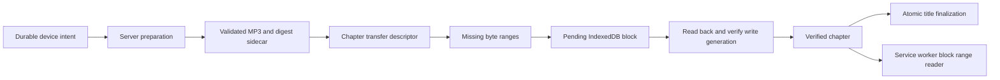

# Offline audio: reliability and performance review

## Scope

This review covers server audio preparation, device transfer, local persistence,
and service-worker playback. It preserves existing downloads and the existing
48 kbps mono, 24 kHz MP3 format. It does not require bulk narration generation,
conversion, or redownload.

Preparation and transfer overlap chapter by chapter. The device resumes at a
verified block boundary after interruption.

## Findings in the previous process

| Finding | Effect | Required correction |
| --- | --- | --- |
| Whole chapter bodies were the persistence unit. | An interruption could discard a large chapter transfer. | Persist and verify 1 MiB blocks, then resume missing blocks. |
| Local range responses read preceding bytes. | A two-byte request near the end of a 100 KiB fixture read all 102,400 bytes. Large-file seeking scaled with offset. | Address the required blocks directly and stream with backpressure. |
| Transfer fetches and body reads had no independent deadline. | A stalled request could hold a download indefinitely despite an outer preparation limit. | Bound response-header wait, body inactivity, metadata requests, and local probes. |
| Quota failures entered the transient retry path. | Repeated network transfer could not correct full storage. | Classify storage failures separately and stop transfer retries. |
| An existing package could be accepted by existence alone. | Truncated or invalid audio could appear ready. | Validate audio during preparation and publish a digest sidecar as the commit marker. |
| Request-time checksums had intentionally been removed. | Reintroducing them would delay streaming and reread complete files on GET. | Calculate identity during preparation; serve stored metadata on GET. |
| Old narration markers did not prove the bytes matched the recipe. | A recipe label could be mistaken for proof of actual generated content. | Track transport integrity and narration provenance separately. |
| Package temporary files were outside the managed-artifact grammar. | Interrupted preparation could leave orphaned files. | Include package staging and sidecar files in cleanup and deletion. |
| Device work and server preparation shared state too closely. | Preparation completion could be confused with durable device completion. | Keep server descriptors separate from verified local state. |

The pre-change targeted baseline passed 161 tests. Those tests did not establish
the interruption, storage, concurrency, and integrity properties above.

## Server artifact contract

Preparation produces an MP3 and a sidecar with its size, whole-file SHA-256,
strong ETag, and ordered block SHA-256 values. A ready descriptor refers to those
exact bytes. Sidecar publication is the commit point; an uncommitted intermediate
file must not be advertised as a verified package.

Encoding and validation are bounded. Preparation must use unique staging files,
limit concurrent package jobs, terminate timed-out subprocesses, and wait for
cancellation before deletion completes. A final publication guard prevents a
cancelled request or deleted book from becoming ready later.

`GET /api/offline/preparation/:bookId/manifest` reads prepared metadata. It must
not generate narration, transcode, or hash the complete audio body. Its canonical
`revision` identifies the descriptor snapshot. `sourceRevision` identifies the
text, variant, and ordered expected recipes independently of chapters becoming
ready.

The device can transfer each ready chapter while the server prepares later
chapters. Window preparation accepts up to four chapter indexes, independently
of the full-book preparation intent.

## Integrity and provenance

Transport integrity answers whether the device holds the bytes named by the
server descriptor. It is established by block verification and immutable
artifact identity.

Narration provenance answers whether those bytes were generated from a proven
recipe. New version-2 narration markers contain the recipe fingerprint, byte
length, content hash, and verified provenance. Reuse of a strict marker requires
checking the content hash. Existing files without that proof remain
`legacy-unverified`, including old stitched chapters. Adding a transport digest
does not upgrade their narration provenance.

For a legacy package, `sourceFingerprint` remains its byte hash.
`associatedRecipeFingerprint` records the recipe associated at preparation time
solely for cache invalidation. It does not prove the narration recipe. A later
recipe change invalidates that association instead of attaching old bytes to a
new source revision.

## Device persistence and transfer

The new writer uses IndexedDB database `xandrio-offline-v4`, schema version 1.
Titles, chapters, blocks, artifact references, and control records have separate
stores. UI state is a hydrated projection; the new writer does not rewrite a
whole localStorage manifest after every block.

Each device intent has a unique durable `storageRevision`. It is separate from
the server's source and descriptor revisions. A replacement stages its chapter
rows under that identity while the previous ready revision remains readable.
Atomic finalization activates the replacement and removes unreferenced data.

Each checkpoint follows this sequence:

1. Store a pending block.
2. Read the stored bytes back.
3. Hash the bytes outside the IndexedDB transaction.
4. Compare the hash with the descriptor and mark the block verified.

After a crash, pending blocks can be verified before requesting more bytes.
Only verified blocks count toward chapter readiness. Requests cover contiguous
missing blocks, with a maximum 16 MiB quantum. The dispatcher can then rotate
between titles. Network buffering remains bounded by the block pipeline.

A single origin-wide lease coordinates browser tabs. Lease ownership and scope
and title epochs are checked in the same transaction as each mutation. Deletion
and account changes fence stale writers before cleanup. Artifact references
prevent rolling-window cleanup from deleting bytes retained by a full download.

A durable local intent must precede the preparation POST. Manual pause persists.
Visibility and connectivity changes interrupt device work without cancelling
server preparation. Foreground recovery resumes eligible intents. Retry policy
must distinguish transient network failures, descriptor changes, permanent
responses, and local storage errors.

## Local playback

The service worker serves
`/__xandrio_offline__/audio/:scope/:artifactId` from verified blocks. The server
returns 404 for this path. The local route has no network fallback.

The response supports HEAD, a single byte range, If-Range, and unsatisfiable
ranges. It reads addressed blocks directly, with backpressure. A known local
miss and an indeterminate storage failure remain distinct. Successful responses
include the service-worker contract and artifact-identity headers.

Readiness requires a bounded local probe that consumes its two-byte response.
Header inspection alone cannot prove that stored bytes can be read. Full-book
readiness also requires every nonempty chapter. Optional artwork must not block
audio readiness.

Legacy downloads retain their existing cache references and playback route.
Migration must not read every cached audio body at application startup or force
existing titles to download again.

## Rollout and rollback

Reader support must precede new writes. The new writer requires compatible
service-worker contract version 2 and an explicit rollout flag:
`xandrio_offline_block_writer_v1=enabled`. Keep legacy readers available during
rollout and rollback. Disabling the writer must not strand completed downloads.

Desktop Chromium and WebKit can verify IndexedDB transactions, streamed local
ranges, cancellation, and browser recovery. They cannot certify physical iPhone
lock-screen behavior, operating-system eviction, or recovery after process
termination. No physical iOS device was connected during this implementation.
Keep the mobile rollout gate until those checks pass on hardware.

## Verification targets

- Package validation, sidecar commit ordering, cancellation, and deletion races.
- Strict narration-marker reuse and preservation of legacy provenance.
- Pending-block recovery and exact missing-range requests after interruption.
- Hash mismatch, truncated body, unexpected status, timeout, and Retry-After.
- Quota and IndexedDB failures without repeated network transfer.
- Cross-tab lease expiry, title deletion, and account transition fencing.
- Direct near-end range reads, HEAD, If-Range, 416, and no network fallback.
- Preparation and transfer overlap without premature local readiness.
- Manual pause and foreground, online, and relaunch recovery.
- Rolling-window preparation and retention without full-download eviction.
- Legacy playback without forced download or boot-time body verification.
- Local complete-suite and browser checks before commit and push.

## Measured block-path checks

The focused block-store suite passed 28 checks in Chromium and WebKit. The
transfer suite passed 18 checks. The standalone benchmark uses generated bodies
and real IndexedDB; it does not measure internet throughput.

Run `node scripts/benchmark-offline-blocks.js --browser=all` to reproduce it.
Across 1, 10, and 100 MiB fixtures, every two-byte near-end read used one
`getBlock` call and no `listBlocks` calls. On this host, the 100 MiB synthetic
transfer and verification took approximately 390 ms in Chromium and 738 ms in
WebKit. Near-end reads took approximately 1–1.2 ms. These are observations, not
portable timing thresholds or measurements of peak browser memory.

Release declaration consistency, Docker-context policy, and calibrated audio
fixtures passed locally. The release dependency audit passed its high-severity
threshold and reported one existing moderate `qs` advisory. That dependency
change is outside this audio implementation.

## Independent review record

The implementation review used a fresh Sol xhigh context, as requested by the
user. The first block-path verdict was **no-ship**. These findings were checked
against the implementation and accepted:

| Finding | Disposition | Required amendment |
| --- | --- | --- |
| Hashing a pending block and then verifying its key could verify a concurrent replacement. | accepted-verified | Give each write a generation ID and compare it atomically when verifying or deleting. |
| An ordinary title save with a newly captured fence could clear a deletion tombstone. | accepted-verified | Reject ordinary saves after deletion; provide explicit revival only for a new download intent. |
| Replacing a title revision retained unreachable full-download artifact references. | accepted-verified | Finalize the revision atomically and collect only artifacts no longer referenced by any owner. |

Regression coverage and the second review retired these three findings.

The first server-path verdict was also **no-ship**. The core artifact and
provenance design was supported, but seven lifecycle findings were accepted
after checking the code:

| Finding | Disposition | Required amendment |
| --- | --- | --- |
| Cancellation missed ensures awaiting initial inspection and could race the sidecar commit. | accepted-verified | Register invocations before awaiting, fence with a book epoch, and reject stale publication after commit. |
| Chunk reconstruction retained a stale file-existence result after strict-cache validation deleted corrupt audio. | accepted-verified | Use the authoritative queue reuse result and regenerate missing audio. |
| Cache validation or publication could finish a cancelled TTS job. | accepted-verified | Carry cancellation through hash and copy work; check before completion. |
| Parallel enqueue calls could both pass output-path deduplication before cache lookup completed. | accepted-verified | Reserve or recheck output ownership after the asynchronous boundary. |
| A consumer that aborted during its guard could still authorize shared publication. | accepted-verified | Recheck consumer membership and cancellation after its guard resolves. |
| A semaphore slot became available before its selected waiter resumed. | accepted-verified | Transfer ownership of the occupied slot directly to the waiter. |
| Startup cleanup omitted the previous `.mp3.part` staging suffix. | accepted-verified | Include the legacy suffix and an upgrade cleanup fixture. |

The second review retired all three original block findings and all seven
original server findings. It then checked the complete integration and found
these additional defects. Each was accepted after checking the code:

| Integration finding | Required amendment |
| --- | --- |
| A replacement lost its ready base, and a same-source replacement could overwrite the active chapter row. | Preserve the prior ready entry and give each intent a durable, unique storage revision separate from source identity. |
| Full-to-rolling registration could discard full ownership during finalization. | Preserve all applicable ownership kinds when reconciling artifact references. |
| A transient local probe could strand already verified bytes. | Persist verification as resumable and wake it when the worker becomes compatible. |
| Manifest JSON body reads outlived the request timeout and cancellation controller. | Bound body size and lifetime, and distinguish resumable metadata failures from exhausted audio retries. |
| Cold worker certification did not wake durable device jobs. | Wake the device dispatcher after certification. |
| Local playback unnecessarily reduced network transfer capacity. | Reserve the lower transfer limit for playback that needs network bandwidth. |
| Source revision omitted expected narration recipe fingerprints. | Include ordered expected recipe identities, stable across pending and ready states. |
| Preparation requests waiting for admission escaped deletion cancellation. | Register invocations synchronously and fence admission with book epochs. |
| Unknown stitched-marker versions were treated as legacy. | Permit only missing markers and explicit version 1 as legacy. |
| Normal chapter preparation did not pass cancellation into the new concatenation API. | Connect the actual preparation call to the abortable subprocess path. |
| Chunk materialization could enqueue work after cancellation during cache lookup. | Carry cancellation through pre-job work, await it before deletion, and cancel any stale newly registered job. |

The application browser check also found a mismatch between the new writer's
activity payload and the existing progress UI. The adapter now publishes the
existing title, percentage, phase, and control contract. This is verified by the
real service-worker smoke flow, not only coordinator tests.

Both review paths endorsed the final amendments. Client ratification additionally
verified same-source replacement with old and new range responses, the actual
2 MiB chunked metadata cap, controller-certification recovery, and streamed versus
local playback throttling. The coordinator passed 14 checks and the offline
integration suite passed 101 checks. Server ratification covered all five
integration amendments, including cancellation before job registration.

The final browser smoke passed with real service-worker offline 206/416 responses
and atomic shell-upgrade failure coverage. All 34 changed JavaScript files passed
syntax checks on Node 24. The complete suite passed **3,381 tests across 176
suites**, with no failures or skips, in an isolated local clone with only the
in-scope changes. An existing unrelated edit to
`test/test-progressive-audio-stream.js` was preserved in the working checkout and
excluded from this change.
